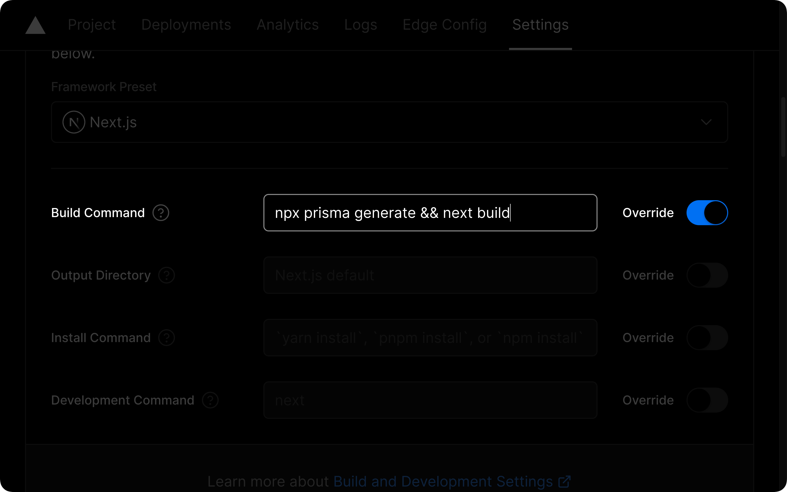

# ⛅ Template Project Next.js, Prisma, and Cloudflare R2

> [!NOTE]
> Template Project Next.js, Prisma, and Cloudflare R2 for Bootcamp devscale.id (Beginner Class).

This is an example template, already set up:

- [daisyUI](https://daisyui.com/)
- [Nano ID](https://www.npmjs.com/package/nanoid)
- [Prisma](https://prisma.io/)
- [Cloudflare R2](https://www.cloudflare.com/developer-platform/r2/)

## Environment Variables

> Vercel Postgres

- POSTGRES_URL
- POSTGRES_PRISMA_URL
- POSTGRES_URL_NO_SSL
- POSTGRES_URL_NON_POOLING
- POSTGRES_USER
- POSTGRES_HOST
- POSTGRES_PASSWORD
- POSTGRES_DATABASE

> Cloudflare R2

- R2_CLOUDFLARE_ENDPOINT
- R2_ACCESSID
- R2_SECRETKEY

## How to use it:

1. Clone this repo or use as template:

- Clone the repo.

```bash
git clone https://github.com/rezarinaldi/devscale-nextjs-prisma-r2.git
# at current directory/folder
git clone https://github.com/rezarinaldi/devscale-nextjs-prisma-r2.git .

# using ssh
git clone git@github.com:rezarinaldi/devscale-nextjs-prisma-r2.git
# at current directory/folder
git clone git@github.com:rezarinaldi/devscale-nextjs-prisma-r2.git .
```

- Create project with template.

```bash
npx create-next-app@latest -e https://github.com/rezarinaldi/devscale-nextjs-prisma-r2
# at current directory/folder
npx create-next-app@latest -e https://github.com/rezarinaldi/devscale-nextjs-prisma-r2 .
```

2. Install dependencies:

```bash
npm install
```

3. Copy the `.env.example` to `.env`:

```bash
cp .env.example .env
```

4. Setting provider database and create database model in the [schema.prisma](./prisma/schema.prisma) file.

```bash
prisma
    └── schema.prisma
```

5. Do prisma migration:

> [!WARNING]
> This step if the database provider used is `SQLite`, otherwise ignore it and skip this step.

```bash
npm run db:migrate
```

6. Use `db push` to push the initial schema to the database:

```bash
npm run db:push
```

7. Run the development server:

```bash
npm run dev
```

8. Open http://localhost:3000 with your browser to see the result.

9. Do prisma studio:

```bash
npm run db:studio
```

10. Open http://localhost:5555 with your browser to see the result.

## Deployment

> [!TIP]
> Don't forget adding `prisma generate` to the existing script build command Vercel.

### Vercel UI's build script field

Another way to configure `prisma generate` to be run on every deployment is to add the command to the build settings via Vercel's UI.

Within your project's dashboard, go to the `Settings` tab and find the `General` section. In that section you will find a box labeled `Build & Development Settings` that contains an input field named `Build Command`:


Within that field, prepend `prisma generate` to the existing script:

```bash
prisma generate && next build
```



Reference: [Vercel build dependency caching workaround](https://www.prisma.io/docs/orm/more/help-and-troubleshooting/help-articles/vercel-caching-issue)
